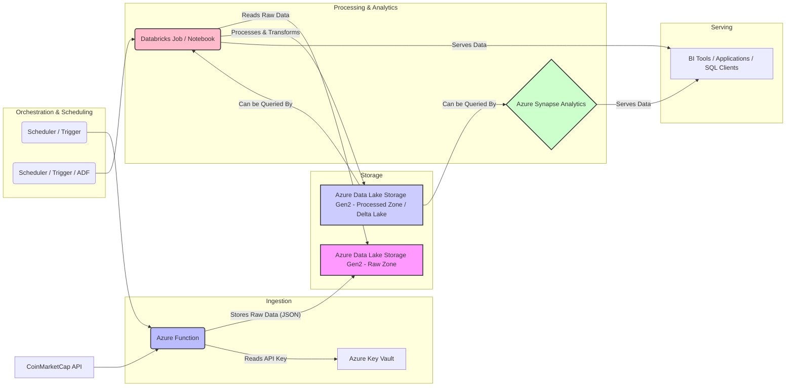
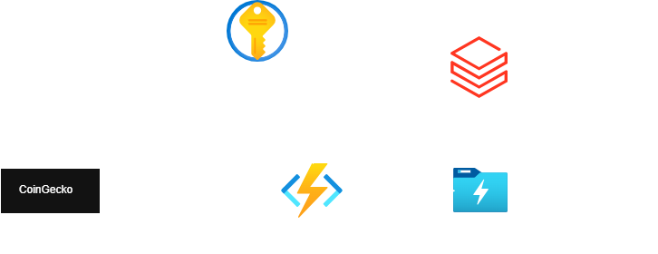

# CoinmarketCap Serverless Pipeline

A data engineer build a simple serverless pipeline with Azure services

## Graph Architecture Diagram

## Architecture

### Unnecessary services

Based on this project:

1. ADF
2. Azure Synapse Analytics
